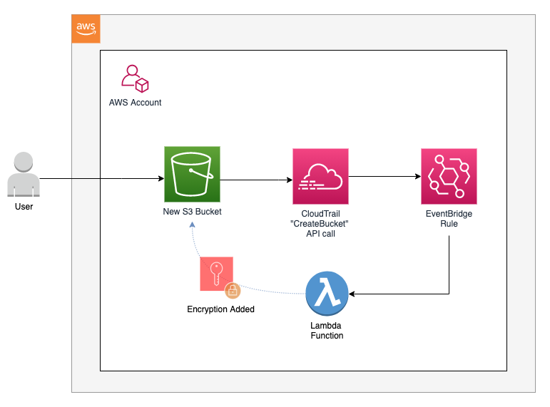
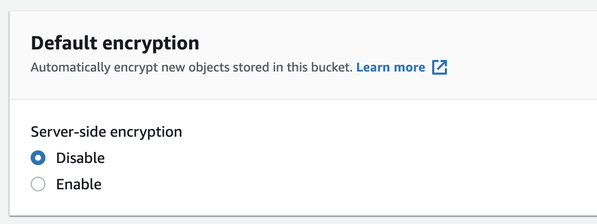
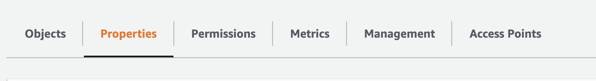
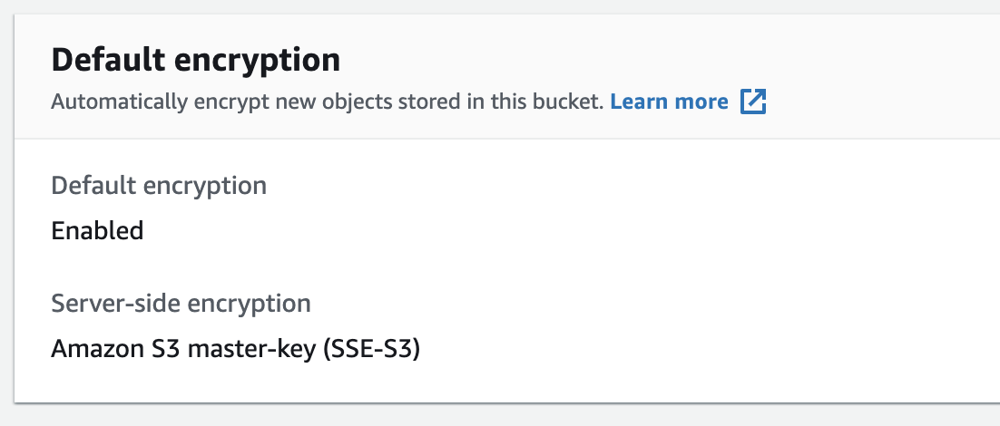

# Autoremediation to Enforce S3 Encryption

The purpose of this template is to build AWS resources that automatically encrypt S3 buckets when they are made without encryption.

AWS Services used in the template to do this:

* Amazon EventBridge
* AWS Lambda
* IAM Role
* Lambda Permission

The EventBridge rule monitors for the creation of a bucket by listening for the API call of `CreateBucket`. When a bucket is created, the EventBridge triggers a Lambda function. The function makes an api call of `GetBucketEncryption` to help determine if the bucket was created with encryption.

As a side note, it may be worth noting that a `CreateBucket` API call does not include information about whether the bucket is encrypted or not. A `GetBucketEncryption` API call is used instead to check the bucket's encryption status. If a bucket is not encrypted, S3 will return a status code as an exception; this is boto3 behavior. This is logged so the function's Amazon CloudWatch LogGroup picks it up. (More information on this behavior here on [GitHub](https://github.com/boto/boto3/issues/1899)).

If the bucket has encryption, nothing will happen except it will log the outcome of the api call to CloudWatch.

If the bucket was not encrypted at the time of its creation, Lambda will enable default encryption on the bucket with an [Amazon S3-managed encryption key](https://docs.aws.amazon.com/AmazonS3/latest/userguide/UsingServerSideEncryption.html) (SSE-S3).

## Diagram



## How to Deploy

### Prerequisites

If you plan to deploy from the command line, you will need the AWS CLI. Instructions on how to download and configure the AWS CLI are available in [AWS documentation](https://docs.aws.amazon.com/cli/latest/userguide/install-cliv2.html).

You will need to have an AWS Account in which you have permissions to deploy CloudFormation stacks to build S3 buckets, Lambda functions and EventBridge rules.

### Deploy from the AWS Console

1. Sign into your AWS Account
2. Navigate to the CloudFormation AWS console
3. Deploy a new stack - follow the instructions to upload a new template, namely the `encrypt_s3_bucket.yaml` file.

### Deploy with the AWS CLI

1. Using your command line, navigate to the root of this repo
2. Update the flags in the following command:

    * `--profile` - this is the profile name you created when configuring your AWS CLI
    * `--stackname` - create a unique name for the CloudFormation stack that will be created upon running this command

3. Run the following command to create a CloudFormation stack to deploy the resources into your account

```bash
aws cloudformation deploy \
--profile [your-aws-cli-profile] \
--stack-name [your-stack-name] \
--template-file encrypt_s3_bucket.yaml \
--capabilities CAPABILITY_IAM
```

## Test the Event Driven Autoremediation

1. Navigate to the S3 console
2. Create a new bucket (do not add encryption when you create the bucket)

    

3. After making the bucket, navigate to the bucket's "Properties" page

    

4. Scroll down to "Default encryption." Note that the bucket now has encryption added to it due to the autoremediation event that was triggered

    
